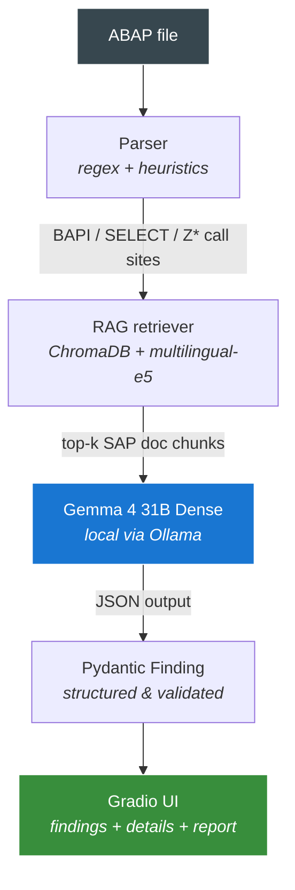

# SAPMigrate

> Local-first ABAP audit assistant for SAP API governance and Clean Core migration — powered by Gemma 4 31B Dense, running 100% offline.

[](https://dev.to/t/gemmachallenge)
[](LICENSE)
[](https://www.python.org/downloads/)
[](https://ollama.com)

---

## The problem

In **April 2026**, SAP published the **SAP API Policy v.4.2026a** (the community commonly refers to this policy as v4/2026), clarifying how customers and partners may use SAP APIs across integration, extension, data access, and AI-driven scenarios.

For ABAP teams modernizing toward Clean Core, this creates a practical audit problem:

- Direct access to SAP standard tables such as `MARA`, `BSEG`, `VBAK`, or `KNA1` is treated by this prototype as a Clean Core and API-governance risk, because it creates direct dependencies on non-released internal data structures and may need remediation toward published APIs, released CDS views, or documented extension points.
- Deprecated BAPIs (e.g., `BAPI_CUSTOMER_CREATEFROMDATA1`) need migration toward supported Business Partner or OData APIs.
- Customer-owned `Z*` and `Y*` function modules are **not** automatically prohibited — they remain customer-developed code and IP. However, undocumented custom wrappers may require review when they expose SAP-internal objects, depend on non-published SAP APIs, or bypass documented API controls.

Companies with large ABAP codebases now need to identify these patterns before Clean Core initiatives or S/4HANA upgrade projects expose them. Today this work is manual, time-consuming, and expensive — typically performed by senior SAP consultants at premium hourly rates.

And here is the twist: **sending proprietary ABAP code to cloud-based LLMs is often not an option.** It is intellectual property, frequently under NDA, and may be subject to GDPR / LGPD / SOX or internal security restrictions.

This is one of those rare cases where local-first AI is not just a preference. For many enterprise SAP landscapes, it is an operational, contractual, or regulatory requirement.

## The solution

SAPMigrate is a working prototype that demonstrates how this type of audit can run **entirely on the auditor's machine**:

1. **ABAP parser** extracts SAP call sites (BAPIs, `SELECT`s on standard tables, and `Z*` / `Y*` function modules).
2. **RAG** over a curated local snapshot of SAP-related documentation retrieves relevant context via ChromaDB + multilingual embeddings.
3. **Gemma 4 31B Dense** (running locally via Ollama) classifies each call as `PUBLISHED`, `INTERNAL`, `DEPRECATED`, `CUSTOM_REVIEW`, or `UNKNOWN`. `INTERNAL` covers non-published SAP objects and direct standard-table access patterns; `CUSTOM_REVIEW` flags customer `Z*` / `Y*` code that should be reviewed by a human auditor.
4. The model suggests remediation or review actions and justifies its decision **in Brazilian Portuguese**, citing the local evidence snippets retrieved by RAG.
5. The system generates an executive report grouped by remediation priority.

**No line of code ever leaves the auditor's machine.**

## Why this is interesting

- **Genuine use case for local-first LLMs.** Most "local AI" demos are nice-to-haves. Here, local execution is driven by the constraints of the domain.
- **Real policy, real timing.** The v4/2026 policy was published in April 2026; this project was built 6 weeks later, in May 2026.
- **Multilingual technical capability.** Headers are in English (for international auditors); the model's justifications are in Brazilian Portuguese. This intentionally showcases Gemma 4 31B Dense's ability to produce dense technical reasoning in PT-BR at publication quality — a meaningful differentiator for non-English markets.
- **Honest scope.** This is a proof of concept, not a finished product. Limitations are declared openly (see below).

## Screenshots

### Findings table
Sortable view of audit findings across the codebase, color-coded by severity.


### Detail view
Each finding includes the LLM's justification in Brazilian Portuguese, citing the local evidence snippets that support the decision.


### Executive report
Auto-generated markdown report grouped by remediation priority.


## Stack

| Layer | Component |
|---|---|
| LLM | Gemma 4 31B Dense by default (`GEMMA_MODEL=gemma4:31b`) |
| Embeddings | `intfloat/multilingual-e5-base` |
| Vector store | ChromaDB (persistent, local) |
| Parser | Python regex + ABAP statement heuristics |
| UI | Gradio (English headers, PT-BR justifications) |
| Validation | Pydantic v2 |
| Hardware tested | NVIDIA RTX 5090 (32 GB VRAM) |

## Why Gemma 4 31B Dense (and not E2B / E4B / 26B MoE)

The choice is deliberate and grounded in a side-by-side comparison on the demo set. I ran the full demo pipeline with both **Gemma 4 31B Dense** and **Gemma 4 E4B**. The full logs are committed in `demo_runs_v4.log` (31B Dense) and `demo_runs_v4_e4b.log` (E4B) for reproducibility.

**What the comparison shows on the demo set:**

- **Classification agreement: 8/8.** Both models assigned the correct category (`PUBLISHED`, `INTERNAL`, `DEPRECATED`, or `CUSTOM_REVIEW`) for every demo finding. E4B produces structured reasoning over the retrieved policy text rather than naive pattern-matching on a small demo set like this one.
- **Severity calibration: 6/8 agreement.** The two models diverge on two findings, and the divergence is the more interesting result:
    - `BAPI_CUSTOMER_CREATEFROMDATA1` (deprecated): 31B Dense → **MEDIUM**, E4B → **HIGH**. E4B inflates severity for a deprecated BAPI that has a clean replacement and a multi-year deprecation runway. 31B Dense reads this as "plan migration, not emergency."
    - `Z_CUSTOM_BUSINESS_RULE` (undocumented Z*): 31B Dense → **HIGH**, E4B → **MEDIUM**. E4B falls back to the default Migration Priority Matrix value. 31B Dense elevates severity because the function name suggests critical business logic and there is no documentation to confirm it does not wrap non-published APIs.

**Why this matters for the audit use case.** A senior SAP auditor's value is not in classifying "what kind of API is this" — junior auditors can do that. The senior's value is in calibrating **how much risk** an undocumented or deprecated call carries in context. On this demo set, 31B Dense's severity assignments track that calibration more consistently than E4B's: conservative on deprecated-with-clear-replacement, aggressive on undocumented-customer-code-with-unknown-dependencies.

For low-stakes scanning or initial triage, **E4B is viable** and runs comfortably on a laptop GPU. For final audit output that an SAP architect will sign off on, 31B Dense is the model this project ships with as default.

**Other Gemma 4 variants:**

- **E2B**: not tested on this demo set; positioned for ultra-edge deployment.
- **26B MoE**: viable alternative, but routing variance can reduce predictability for structured-output tasks where deterministic JSON matters.
- **31B Dense**: ~22 GB VRAM, predictable JSON output, severity calibration aligned with senior-auditor judgment on this demo set, and native PT-BR technical fluency.

The **256K context window** is strategically useful rather than merely convenient: it allows the prototype to combine system instructions, ABAP excerpts, retrieved policy context, and few-shot examples without aggressive truncation. In production, the same design can scale to larger code excerpts, module-specific documentation, and richer audit histories (Gemma 4's larger variants — 26B MoE and 31B Dense — ship with 256K; the edge models E2B and E4B use 128K).

## How to run

### Prerequisites

- Python 3.10+
- [Ollama](https://ollama.com) installed (Windows, Linux, or macOS)
- GPU with 20+ GB VRAM for `gemma4:31b` (tested on RTX 5090) — see "Running on smaller hardware" below
- ~25 GB of disk for the default Gemma 4 31B model; less if using E4B/E2B for demo mode

### Installation

```bash
git clone https://github.com/PauloAAlmeida/sapmigrate.git
cd sapmigrate

# Create venv
python3 -m venv .venv
source .venv/bin/activate  # Linux/WSL/macOS
# or: .venv\Scripts\activate  # Windows

# Install dependencies
pip install -r requirements.txt

# Pull Gemma 4 31B (one-time, ~19 GB download)
ollama pull gemma4:31b

# Build the RAG index from curated docs (one-time)
python rag/ingest.py

# Launch the UI
python app.py
```

Open <http://localhost:7860> in your browser, drag-and-drop ABAP files into the upload area, and click **Audit**.

### Try it with the demo dataset

The `demo/` folder contains 6 small ABAP files covering the main expected outcomes: `PUBLISHED`, `INTERNAL`, `DEPRECATED`, and `CUSTOM_REVIEW`. After launching the UI, upload all 6 files and you should see **8 audited calls**, of which **6 are reported as findings across 4 files**: 4 violations and 2 review flags. Severities include CRITICAL for direct table access, HIGH for risky custom review cases, and MEDIUM for deprecated BAPIs with clear replacements.

### Running on smaller hardware

The default configuration uses **Gemma 4 31B Dense**, which produced the most consistent severity calibration on the demo set and is the configuration this project ships with.

If your hardware is more modest, you can swap the model via environment variable:

```bash
# Gemma 4 E4B: faster, lower VRAM, classifies well but with different severity calibration
GEMMA_MODEL=gemma4:e4b python app.py

# Gemma 4 E2B: smallest profile, demo-only
GEMMA_MODEL=gemma4:e2b python app.py
```

Smaller variants are usable for the parser, RAG pipeline, UI, and reporting flow. On this demo set, E4B reaches the correct classification on all 8 findings but assigns severities that differ from 31B Dense on 2 of them (see "Why Gemma 4 31B Dense" above). For audit-quality severity calibration, **31B Dense remains the recommended model**.

### Note on environment variables

If Ollama is running on Windows and you call from WSL2, you may need to point the client at the Windows host:

```bash
export OLLAMA_HOST="http://$(ip route show | grep -i default | awk '{print $3}'):11434"
```

### Note for Windows users (Git Bash / Anaconda Prompt)

If you run SAPMigrate on Windows with Anaconda Python or in a `cp1252`-default terminal, you may see:

```
UnicodeEncodeError: 'charmap' codec can't encode character '\U0001f4cb'
```

This is a Windows-specific encoding issue: the legacy `cp1252` codec doesn't support the emoji characters used in console output. Fix by exporting UTF-8 mode before running:

```bash
# Git Bash
export PYTHONIOENCODING=utf-8
export PYTHONUTF8=1

# Or in CMD / PowerShell
set PYTHONIOENCODING=utf-8
set PYTHONUTF8=1
```

WSL2 and native Linux/macOS terminals are not affected.

## Architecture



## On the RAG corpus

By default, SAPMigrate ships with a **small curated snapshot** of SAP documentation in `rag/docs/`:

- `api_policy_v4_2026.md` — synthesis of the policy
- `business_accelerator_hub.md` — reference list of released APIs
- `clean_core_principles.md` — Clean Core architectural rules
- `deprecated_apis.md` — migration reference for legacy patterns

These documents are written **by the author** based on public SAP information, formatted for retrieval purposes. They are not redistributions of SAP-proprietary content.

For a production-grade audit, you would replace this with a real snapshot of:

- [SAP Business Accelerator Hub](https://api.sap.com)
- [SAP Help Portal](https://help.sap.com)
- Relevant SAP Notes for the modules your organization uses

The pipeline is designed so that swapping the contents of `rag/docs/` and re-running `python rag/ingest.py` is enough to adapt the auditor to your organization's specific SAP landscape.

## Demo Evaluation

The demo dataset contains 6 small ABAP files covering four classification outcomes: PUBLISHED, INTERNAL, DEPRECATED, and CUSTOM_REVIEW.
Running the full pipeline on the demo set with the default `GEMMA_MODEL=gemma4:31b` produces:

| Metric | Value |
|---|---|
| Files analyzed | 6 |
| Audit candidates extracted | 8 |
| Compliant calls (PUBLISHED) | 2 |
| Violations or review flags | 6 |
| JSON output validity (Pydantic) | 8/8 |
| Determinism across reruns | Same class/severity across runs; justification wording varies slightly |
| Average latency per finding | ~10–15 s (RTX 5090, Q4_K_M) |
| Peak VRAM (Gemma 4 31B Dense + embeddings) | ~22 GB |

This is a reproducibility smoke test, not a statistically meaningful benchmark. Its purpose is to prove that the full parser → RAG → Gemma → validation → report pipeline works end to end.

> **Note:** Earlier iteration logs (`demo_runs.log`, `demo_runs_v2.log`, `demo_runs_v3.log`) are kept in the repo as a record of how the classifier evolved during development. The current reference run is `demo_runs_v4.log`.

### Classification breakdown by demo file (31B Dense vs E4B)

Side-by-side output of both models on the same demo set, with the same RAG index, prompt, and temperature (0.1). Raw logs: `demo_runs_v4.log` (31B Dense), `demo_runs_v4_e4b.log` (E4B).

| Demo file | SAP object | 31B Dense | E4B | Agree? |
|---|---|---|---|---|
| `01_purchase_order_create.abap` | BAPI_PO_CREATE1 | PUBLISHED \| LOW | PUBLISHED \| LOW | ✅ |
| `02_direct_table_access.abap` | MARA | INTERNAL \| CRITICAL | INTERNAL \| CRITICAL | ✅ |
| `02_direct_table_access.abap` | MARC | INTERNAL \| CRITICAL | INTERNAL \| CRITICAL | ✅ |
| `03_deprecated_customer_bapi.abap` | BAPI_CUSTOMER_CREATEFROMDATA1 | DEPRECATED \| **MEDIUM** | DEPRECATED \| **HIGH** | class only |
| `04_mixed_violations.abap` | VBAK | INTERNAL \| CRITICAL | INTERNAL \| CRITICAL | ✅ |
| `04_mixed_violations.abap` | BAPI_SALESORDER_CREATEFROMDAT2 | PUBLISHED \| LOW | PUBLISHED \| LOW | ✅ |
| `04_mixed_violations.abap` | Z_INTERNAL_PRICE_CALC | CUSTOM_REVIEW \| HIGH | CUSTOM_REVIEW \| HIGH | ✅ |
| `05_clean_core_pattern.abap` | (modern OData wrapper) | no candidates extracted | no candidates extracted | ✅ |
| `06_ambiguous_zfunction.abap` | Z_CUSTOM_BUSINESS_RULE | CUSTOM_REVIEW \| **HIGH** | CUSTOM_REVIEW \| **MEDIUM** | class only |

**Summary:** 8/8 classification agreement, 6/8 severity agreement. The two divergences are at the auditor's calibration boundary — exactly where senior-auditor judgment matters most.

### Notable behavior

The model exhibits multi-step reasoning over retrieved policy text rather than pattern-matching. Two examples:

1. **Severity elevation with explicit justification.** For `Z_CUSTOM_BUSINESS_RULE`, the Migration Priority Matrix would default undocumented Z* to MEDIUM severity. 31B Dense elevated to HIGH and explicitly justified the elevation: insufficient documentation prevented confirming the function does not wrap non-published APIs. E4B, on the same input, stayed at the matrix default of MEDIUM.

2. **Context-aware classification of customer code.** Z* functions are *not* automatically flagged as INTERNAL — the policy treats customer namespace as customer-owned IP. The model correctly assigns `CUSTOM_REVIEW` for Z* code that may wrap non-published SAP APIs, while keeping direct standard-table access (`MARA`, `MARC`, `VBAK`) firmly classified as `INTERNAL` findings requiring remediation.

## Limitations (honest scope)

This is a proof of concept. Known limitations:

- **Regex-based parser, not full AST.** Misses edge cases such as dynamic calls (`CALL FUNCTION lv_name`) and complex macros.
- **Small synthetic demo set.** Real ABAP codebases have 10x more noise; the prototype's recall on real-world code has not been measured.
- **Static snapshot of SAP docs.** No live tracking of SAP Notes or product release changes.
- **Synthesis-based RAG corpus.** The default `rag/docs/` files are author-curated syntheses for prototype purposes, not redistributed SAP-proprietary documentation. For production use, the corpus should be replaced with snapshots of actual SAP Help Portal pages and product-specific documentation relevant to your landscape.
- **No tested support for non-ABAP code paths** (e.g., SAP CPI flows, JCo Java integrations). The architecture supports this but it is not implemented.
- **PT-BR justifications only.** A multilingual UI (EN/DE justifications) would be straightforward to add but is not in scope.

This tool reduces a senior SAP auditor's time, it does not replace them.

## What I learned about Gemma 4 31B Dense

Working notes from building this prototype:

1. **JSON output is solid out of the box.** With `format="json"` and `temperature=0.1`, all 8 demo classifications produced valid JSON parseable by Pydantic with zero retries.
2. **Deterministic enough for product use.** Re-running the same input twice produced identical classifications and severity scores. Justification wording varies slightly, which is acceptable.
3. **PT-BR technical fluency is real.** The model produces auditor-style sentences such as *"O acesso direto à tabela MARA via SELECT cria uma dependência direta de estrutura interna não publicada e deve ser revisado no contexto de Clean Core, APIs publicadas e documentação específica do produto."* — terminology, structure, and tone match a senior auditor's report.
4. **The 31B vs E4B gap is about severity calibration, not classification.** Both models classify correctly on the demo set. The difference shows up when assigning *how much risk* a finding carries: 31B Dense is more conservative on deprecated APIs with clear replacements, and more aggressive on undocumented Z* code with unknown dependencies. E4B is more uniform — closer to the default Migration Priority Matrix value in both directions.
5. **256K context is comfortable.** No need for chunk-juggling when combining system prompt + code + 3 RAG snippets + few-shots. The 31B and 26B MoE variants ship with this larger context window; edge models (E2B, E4B) use 128K, which is also enough for typical audit prompts.

## Roadmap

If extended beyond a proof of concept:

- Full ABAP AST parser (ANTLR-based)
- Live SAP Notes / Accelerator Hub integration via authenticated APIs
- Patch generation for common migration patterns (BAPI swap, OData wrapper)
- CI/CD gate mode: block merges on `CRITICAL` findings
- Support for SAP CPI flows, JCo Java integrations
- Multilingual justifications (EN, DE) selectable per user

## On AI assistance

During development I used AI coding assistants (large language models) for ideation, code review, debugging, and writing polish. The project architecture, implementation, SAP domain assumptions, evaluation setup, and final submission were authored, reviewed, and validated by Paulo Almeida.

Gemma 4 31B Dense is not merely a development aid in this project: it is the local runtime model used by SAPMigrate to classify ABAP call sites, reason over retrieved documentation, and generate audit justifications. No uploaded ABAP code leaves the user's machine during application execution.

## License

[MIT](LICENSE). Use at your own risk.

## Acknowledgements

- Submission for the [Gemma 4 Challenge](https://dev.to/t/gemmachallenge) by [DEV Community](https://dev.to) and Google.
- SAP documentation references are public; this project does not redistribute SAP-proprietary content.
- SAP, ABAP, S/4HANA, and related product names are trademarks of SAP SE or its affiliates. This project is an independent educational prototype and is not affiliated with or endorsed by SAP.
- SAPMigrate is an engineering audit assistant, not a legal compliance determination tool. Findings should be reviewed by qualified SAP architects, security teams, and legal/compliance stakeholders before being treated as policy violations.

---

**Author:** Paulo Almeida ([@PauloAAlmeida](https://github.com/PauloAAlmeida)) — Senior Data Scientist & AI Engineer, working on RAG in dense technical domains (legal, financial).
