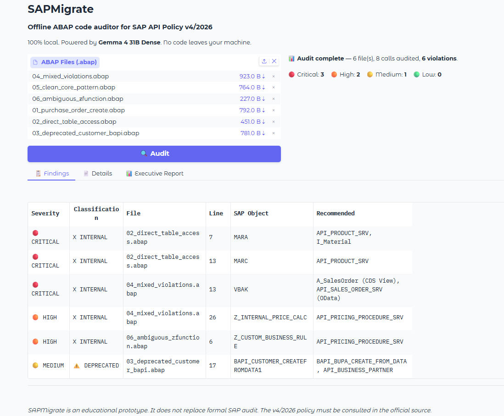
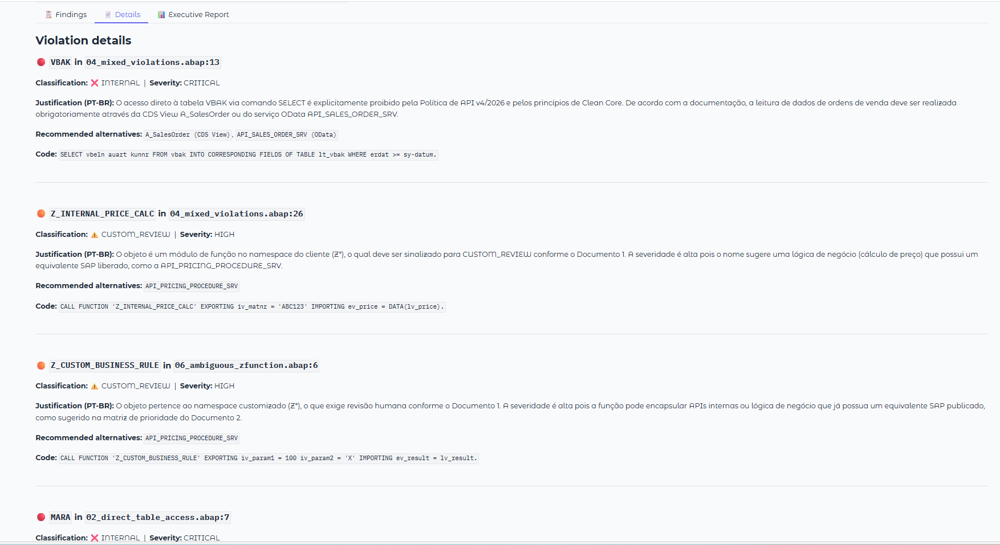
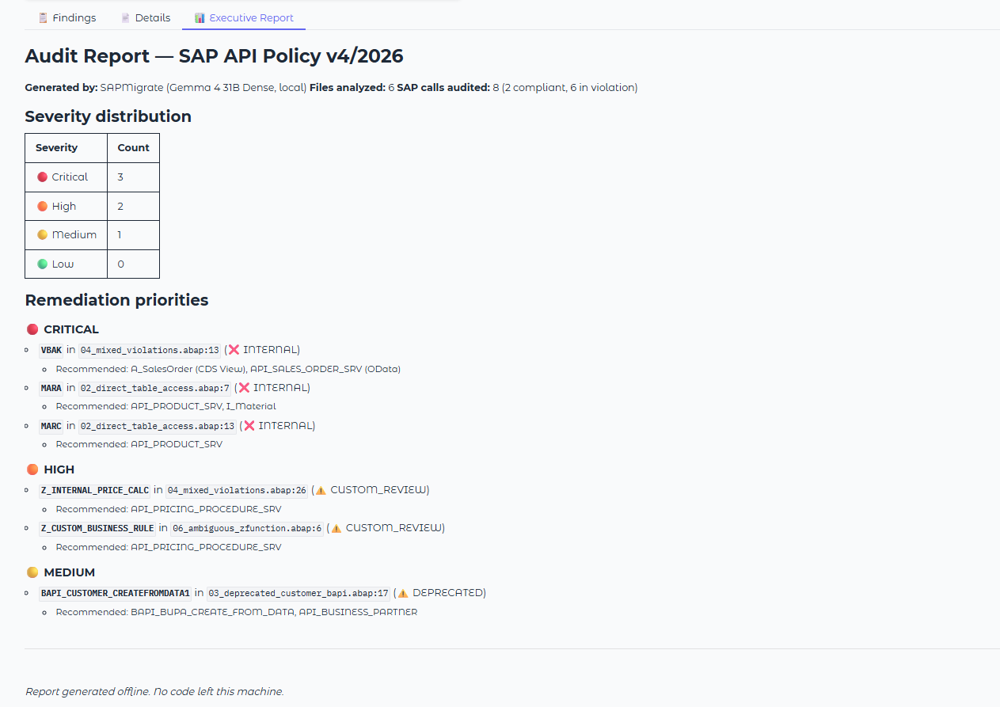
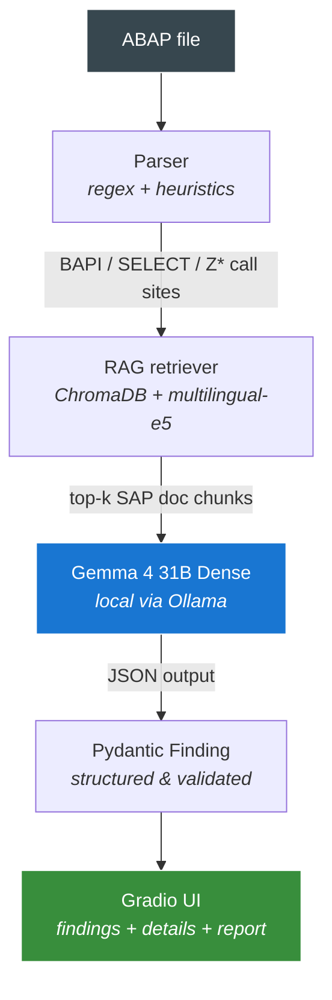

# SAPMigrate

> Offline ABAP code auditor for SAP API Policy v.4.2026a — powered by Gemma 4 31B Dense, running 100% locally.

[](https://dev.to/t/gemmachallenge)
[](LICENSE)
[](https://www.python.org/downloads/)
[](https://ollama.com)

---

## The problem

In **April 2026**, SAP published the **SAP API Policy v.4.2026a** (the community commonly refers to this policy as v4/2026), clarifying how customers and partners may use SAP APIs across integration, extension, data access, and AI-driven scenarios.

For ABAP teams modernizing toward Clean Core, this creates a practical audit problem:

- Direct access to SAP standard tables such as `MARA`, `BSEG`, `VBAK`, or `KNA1` bypasses the released API layer and should be replaced with published APIs or CDS views.
- Deprecated BAPIs (e.g., `BAPI_CUSTOMER_CREATEFROMDATA1`) need migration toward supported Business Partner or OData APIs.
- Customer-owned `Z*` and `Y*` function modules are **not** automatically prohibited — they remain customer-developed code and IP. However, undocumented custom wrappers may require review when they expose SAP-internal objects, depend on non-published SAP APIs, or bypass documented API controls.

Companies with large ABAP codebases now need to identify these patterns before Clean Core initiatives or S/4HANA upgrade projects expose them. Today this work is manual, time-consuming, and expensive — typically performed by senior SAP consultants at premium hourly rates.

And here is the twist: **sending proprietary ABAP code to cloud-based LLMs is often not an option.** It is intellectual property, frequently under NDA, and may be subject to GDPR / LGPD / SOX or internal security restrictions.

This is one of those rare cases where local-first AI is not just a preference. For many enterprise SAP landscapes, it is an operational, contractual, or regulatory requirement.

## The solution

SAPMigrate is a working prototype that demonstrates how this type of audit can run **entirely on the auditor's machine**:

1. **ABAP parser** extracts SAP call sites (BAPIs, `SELECT`s on standard tables, and `Z*` / `Y*` function modules).
2. **RAG** over a curated local snapshot of SAP-related documentation retrieves relevant context via ChromaDB + multilingual embeddings.
3. **Gemma 4 31B Dense** (running locally via Ollama) classifies each call as `PUBLISHED`, `INTERNAL`, `DEPRECATED`, `CUSTOM_REVIEW`, or `UNKNOWN`. `INTERNAL` covers non-published SAP objects and direct standard-table access patterns; `CUSTOM_REVIEW` flags customer `Z*` / `Y*` code that should be reviewed by a human auditor.
4. The model suggests remediation or review actions and justifies its decision **in Brazilian Portuguese**, citing the local evidence snippets retrieved by RAG.
5. The system generates an executive report grouped by remediation priority.

**No line of code ever leaves the auditor's machine.**

## Why this is interesting

- **Genuine use case for local-first LLMs.** Most "local AI" demos are nice-to-haves. Here, local execution is driven by the constraints of the domain.
- **Real policy, real timing.** The v4/2026 policy was published in April 2026; this project was built 6 weeks later, in May 2026.
- **Multilingual technical capability.** Headers are in English (for international auditors); the model's justifications are in Brazilian Portuguese. This intentionally showcases Gemma 4 31B Dense's ability to produce dense technical reasoning in PT-BR at publication quality — a meaningful differentiator for non-English markets.
- **Honest scope.** This is a proof of concept, not a finished product. Limitations are declared openly (see below).

## Screenshots

### Findings table
Sortable view of violations across the codebase, color-coded by severity.



### Detail view
Each finding includes the LLM's justification in Brazilian Portuguese, citing the local evidence snippets that support the decision.



### Executive report
Auto-generated markdown report grouped by remediation priority.



## Stack

| Layer | Component |
|---|---|
| LLM | Gemma 4 31B Dense by default (`GEMMA_MODEL=gemma4:31b`) |
| Embeddings | `intfloat/multilingual-e5-base` |
| Vector store | ChromaDB (persistent, local) |
| Parser | Python regex + ABAP statement heuristics |
| UI | Gradio (English headers, PT-BR justifications) |
| Validation | Pydantic v2 |
| Hardware tested | NVIDIA RTX 5090 (32 GB VRAM) |

## Why Gemma 4 31B Dense (and not E2B / E4B / 26B MoE)

The choice is deliberate and central to the project. Across the Gemma 4 options relevant to this project:

- **E2B / E4B**: useful for lightweight local demos, but in my local SAP audit tests they were less reliable for dense technical reasoning over ABAP + retrieved policy context. They more often confused `DEPRECATED`, `INTERNAL`, and `CUSTOM_REVIEW` cases.
- **26B MoE**: viable alternative, but routing variance reduces predictability for structured-output tasks. For an auditing tool, deterministic JSON output matters.
- **31B Dense**: the sweet spot for this use case. Comfortable in ~20 GB of VRAM, predictable output, strong technical reasoning, native multilingual capability that produces PT-BR justifications matching the quality of a senior auditor's report.

The **128K context window** is critical: each classification prompt includes the system instructions, the code excerpt, up to 3 RAG-retrieved excerpts, and few-shot examples — comfortably under the limit, no chunk-juggling needed.

## How to run

### Prerequisites

- Python 3.10+
- [Ollama](https://ollama.com) installed (Windows, Linux, or macOS)
- GPU with 20+ GB VRAM for `gemma4:31b` (tested on RTX 5090) — see "Running on smaller hardware" below
- ~25 GB of disk for the default Gemma 4 31B model; less if using E4B/E2B for demo mode

### Installation

```bash
git clone https://github.com/PauloAAlmeida/sapmigrate.git
cd sapmigrate

# Create venv
python3 -m venv .venv
source .venv/bin/activate  # Linux/WSL/macOS
# or: .venv\Scripts\activate  # Windows

# Install dependencies
pip install -r requirements.txt

# Pull Gemma 4 31B (one-time, ~19 GB download)
ollama pull gemma4:31b

# Build the RAG index from curated docs (one-time)
python rag/ingest.py

# Launch the UI
python app.py
```

Open <http://localhost:7860> in your browser, drag-and-drop ABAP files into the upload area, and click **Audit**.

### Try it with the demo dataset

The `demo/` folder contains 6 small ABAP files covering the main expected outcomes: `PUBLISHED`, `INTERNAL`, `DEPRECATED`, and `CUSTOM_REVIEW`. After launching the UI, upload all 6 files and you should see **8 audited calls**, of which **6 are reported as findings across 4 files**: 4 violations and 2 review flags. Severities include CRITICAL for direct table access, HIGH for risky custom review cases, and MEDIUM for deprecated BAPIs with clear replacements.

### Running on smaller hardware

The default configuration uses **Gemma 4 31B Dense**, which produced the best classification quality in my local SAP audit tests and is the configuration this project was tuned and evaluated with.

If your hardware is more modest, you can swap the model via environment variable:

```bash
# Gemma 4 E4B: faster, lower VRAM, useful for demos
GEMMA_MODEL=gemma4:e4b python app.py

# Gemma 4 E2B: smallest profile, demo-only
GEMMA_MODEL=gemma4:e2b python app.py
```

Smaller variants let you test the parser, RAG pipeline, UI, and reporting flow on consumer hardware. However, they were less reliable on nuanced SAP audit cases in my local tests, especially when distinguishing `DEPRECATED`, `INTERNAL`, and `CUSTOM_REVIEW`. For audit-quality reasoning, **31B Dense remains the recommended model**.


### Note on environment variables

If Ollama is running on Windows and you call from WSL2, you may need to point the client at the Windows host:

```bash
export OLLAMA_HOST="http://$(ip route show | grep -i default | awk '{print $3}'):11434"
```

## Architecture



## On the RAG corpus

By default, SAPMigrate ships with a **small curated snapshot** of SAP documentation in `rag/docs/`:

- `api_policy_v4_2026.md` — synthesis of the policy
- `business_accelerator_hub.md` — reference list of released APIs
- `clean_core_principles.md` — Clean Core architectural rules
- `deprecated_apis.md` — migration reference for legacy patterns

These documents are written **by the author** based on public SAP information, formatted for retrieval purposes. They are not redistributions of SAP-proprietary content.

For a production-grade audit, you would replace this with a real snapshot of:
- [SAP Business Accelerator Hub](https://api.sap.com)
- [SAP Help Portal](https://help.sap.com)
- Relevant SAP Notes for the modules your organization uses

The pipeline is designed so that swapping the contents of `rag/docs/` and re-running `python rag/ingest.py` is enough to adapt the auditor to your organization's specific SAP landscape.

## Evaluation

The demo dataset contains 6 small ABAP files covering four classification outcomes: PUBLISHED, INTERNAL, DEPRECATED, and CUSTOM_REVIEW.
Running the full pipeline on the demo set with the default `GEMMA_MODEL=gemma4:31b` produces:

| Metric | Value |
|---|---|
| Files analyzed | 6 |
| Audit candidates extracted | 8 |
| Compliant calls (PUBLISHED) | 2 |
| Violations or review flags | 6 |
| JSON output validity (Pydantic) | 8/8 |
| Determinism across reruns | Same class/severity across runs; justification wording varies slightly |
| Average latency per finding | ~10–15 s (RTX 5090, Q4_K_M) |
| Peak VRAM (Gemma 4 31B Dense + embeddings) | ~22 GB |

### Classification breakdown by demo file

| Demo file | SAP object | Classification | Severity |
|---|---|---|---|
| `01_purchase_order_create.abap` | BAPI_PO_CREATE1 | PUBLISHED | LOW |
| `02_direct_table_access.abap` | MARA | INTERNAL | CRITICAL |
| `02_direct_table_access.abap` | MARC | INTERNAL | CRITICAL |
| `03_deprecated_customer_bapi.abap` | BAPI_CUSTOMER_CREATEFROMDATA1 | DEPRECATED | MEDIUM |
| `04_mixed_violations.abap` | VBAK | INTERNAL | CRITICAL |
| `04_mixed_violations.abap` | BAPI_SALESORDER_CREATEFROMDAT2 | PUBLISHED | LOW |
| `04_mixed_violations.abap` | Z_INTERNAL_PRICE_CALC | CUSTOM_REVIEW | HIGH |
| `05_clean_core_pattern.abap` | (modern OData wrapper) | no candidates extracted | — |
| `06_ambiguous_zfunction.abap` | Z_CUSTOM_BUSINESS_RULE | CUSTOM_REVIEW | HIGH |

### Notable behavior

The model exhibits multi-step reasoning over retrieved policy text rather than
pattern-matching. Two examples:

1. **Severity elevation with explicit justification.** For
   `Z_CUSTOM_BUSINESS_RULE`, the Migration Priority Matrix would default
   undocumented Z* to MEDIUM severity. The model elevated to HIGH and
   explicitly justified the elevation: insufficient documentation prevented
   confirming the function does not wrap non-published APIs.

2. **Context-aware classification of customer code.** Z* functions are
   *not* automatically flagged as INTERNAL — the policy treats customer
   namespace as customer-owned IP. The model correctly assigns
   `CUSTOM_REVIEW` for Z* code that may wrap non-published SAP APIs,
   while keeping direct standard-table access (MARA, MARC, VBAK) firmly
   classified as `INTERNAL` violations.

Smaller models in the Gemma 4 family (E2B/E4B) do not exhibit this
multi-step reasoning over policy text in our local testing.


## Limitations (honest scope)

This is a proof of concept. Known limitations:

- **Regex-based parser, not full AST.** Misses edge cases such as dynamic calls (`CALL FUNCTION lv_name`) and complex macros.
- **Small synthetic demo set.** Real ABAP codebases have 10x more noise; the prototype's recall on real-world code has not been measured.
- **Static snapshot of SAP docs.** No live tracking of SAP Notes or product release changes.
- **Synthesis-based RAG corpus.** The default `rag/docs/` files are author-curated syntheses for prototype purposes, not redistributed SAP-proprietary documentation. For production use, the corpus should be replaced with snapshots of actual SAP Help Portal pages and product-specific documentation relevant to your landscape.
- **No tested support for non-ABAP code paths** (e.g., SAP CPI flows, JCo Java integrations). The architecture supports this but it is not implemented.
- **PT-BR justifications only.** A multilingual UI (EN/DE justifications) would be straightforward to add but is not in scope.

This tool reduces a senior SAP auditor's time, it does not replace them.

## What I learned about Gemma 4 31B Dense

Working notes from building this prototype:

1. **JSON output is solid out of the box.** With `format="json"` and `temperature=0.1`, all 8 demo classifications produced valid JSON parseable by Pydantic with zero retries.
2. **Deterministic enough for product use.** Re-running the same input twice produced identical classifications and severity scores. Justification wording varies slightly, which is acceptable.
3. **PT-BR technical fluency is real.** The model produces sentences like *"O acesso direto à tabela MARA via SELECT é explicitamente proibido pela política v4/2026"* — terminology, structure, and tone match a senior auditor's report.
4. **Reasoning in layers.** In one test case (`Z_CUSTOM_BUSINESS_RULE`), the model recognized that customer Z* code is not automatically prohibited by the policy, flagged it as `CUSTOM_REVIEW` (not `INTERNAL`), and elevated severity to `HIGH` because the function name suggested critical business logic without supporting documentation. The model justified each decision explicitly, citing the retrieved policy excerpts. Smaller Gemma 4 variants (E2B/E4B) do not exhibit this multi-step reasoning over retrieved policy text in our local testing.
5. **128K context is comfortable.** No need for chunk-juggling when combining system prompt + code + 3 RAG snippets + few-shots.

## Roadmap

If extended beyond a proof of concept:

- Full ABAP AST parser (ANTLR-based)
- Live SAP Notes / Accelerator Hub integration via authenticated APIs
- Patch generation for common migration patterns (BAPI swap, OData wrapper)
- CI/CD gate mode: block merges on `CRITICAL` findings
- Support for SAP CPI flows, JCo Java integrations
- Multilingual justifications (EN, DE) selectable per user

## License

[MIT](LICENSE). Use at your own risk.

## Acknowledgements

- Submission for the [Gemma 4 Challenge](https://dev.to/t/gemmachallenge) by [DEV Community](https://dev.to) and Google.
- SAP documentation references are public; this project does not redistribute SAP-proprietary content.
- SAP, ABAP, S/4HANA, and related product names are trademarks of SAP SE or its affiliates. This project is an independent educational prototype and is not affiliated with or endorsed by SAP.

---

**Author:** Paulo Almeida ([@PauloAAlmeida](https://github.com/PauloAAlmeida)) — Applied Scientist, working on RAG in dense technical domains (legal, financial).
